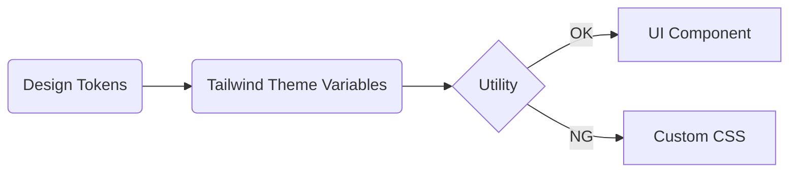

## Viteのプロジェクトの作成 (第一陣)

Vite + Vue + TypeScriptの構成を選択します。
(見出しの通り、後ほど第二陣もあります。)

```zsh:zsh
  pnpm create vite@latest hands-on-app  --template vue-ts
  cd path/to/hands-on-app
  pnpm install
```

## Tailwind CSSのインストール

公式ドキュメント通りにインストールと初期設定を行います。
[Install Tailwind CSS with Vite | Installation](https://tailwindcss.com/docs/guides/vite#vue)

`create vite` で生成されたボイラープレートで残す必要の無いものは書き換えてしまって問題ありません。 `style.css` `vite.config.ts` の変更を忘れないようにしてください。
Installationに記載されている通りに `App.vue` にUtilityを適用し、dev modeでさっと確認しておきましょう。

```vue:src/App.vue
<template>
  <h1 class="text-3xl font-bold underline">Hello world!</h1>
</template>
```

<!-- prettier-ignore-start -->

*このようにスタイルが適用されます👌*
<!-- prettier-ignore-end -->

### Theme Variablesのカスタマイズ

`@theme > color`[^1] に `primary` `secondary` を追加します。
[^1]: [Theme Variables | Tailwind CSS](https://tailwindcss.com/docs/theme)

```diff css:style.css
  @import "tailwindcss";

+ @theme {
+   --color-primary: #0054e9;
+   --color-primary-contrast: #ffffff;
+   --color-primary-shade: #004acd;
+   --color-primary-tint: #1a65eb;
+
+   --color-secondary: #0163aa;
+   --color-secondary-contrast: #ffffff;
+   --color-secondary-shade: #015796;
+   --color-secondary-tint: #1a73b3;
+ }
```

追加したVariablesをutilityから使ってみましょう。

```diff vue:src/App.vue
 <template>
-  <h1 class="text-3xl font-bold underline">Hello world!</h1>
+  <div class="flex flex-col gap-y-2 p-4">
+    <div
+      class="flex flex-col items-center justify-center bg-primary w-80 h-8 rounded-md"
+    >
+      <span class="text-primary-contrast">Primary Box</span>
+    </div>
+
+    <p class="text-primary-shade text-sm">Primary Shade</p>
+    <p class="text-primary-tint text-lg">Primary Tint</p>
+
+    <div
+      class="flex flex-col items-center justify-center bg-secondary w-80 h-8 rounded-md"
+    >
+      <span class="text-secondary-contrast">Secondary Box </span>
+    </div>
+
+    <p class="text-secondary-shade text-sm">Secondary Shade</p>
+    <p class="text-secondary-tint text-lg">Secondary Tint</p>
+  </div>
 </template>
```

<!-- prettier-ignore-start -->

*このように表示されればOKです👌*
<!-- prettier-ignore-end -->

## 🤔なぜTailwind CSSを選ぶのか

### Utility First

Tailwind CSSは、CSS ModulesやSCSSのようにゼロからstyleを書かずに[Utilityを組み合わせてスタイルを表現するのが特徴](https://tailwindcss.com/docs/styling-with-utility-classes)です。CSSセレクタの粒度と命名を開発者ではなくTailwindがハンドリングすることで(良い意味で)実装に制約を生み、カスタムCSSの乱立を防ぐことが可能です。

### コンポーネントファーストなWebフロントエンド開発との親和性

また、Tailwind CSSは上記のような特徴からVue/ReactのようなコンポーネントファーストなWebフロントエンド技術と親和性が高いです。Utilitiesの集合をコンポーネントとしてカプセル化することで、`スタイルの再利用 (Utilitiesの集合) ≒ コンポーネント化` のような設計指針が実現できます。これにより、コンポーネント単位のCSSを都度作らずにアプリケーション内で一貫したStyleを保つことができます。



### デザインシステムのビルドツールであること

Tailwind CSSは単なるCSSライブラリではなく、独自のデザインシステムを構築するための土台としても有効です。
`@theme` を通じてプロジェクト固有のデザイントークン (Colors, Typography, Spacing...)をUtilitiesに反映できます。デザインシステムとアプリケーション固有のデザインがそれぞれ存在する場合も、それぞれのTheme Variablesを取り入れることで、アプリケーションに最適化されたThemeを構成します。

余談ですが、私はVuetifyやMUIのような優れたデザインシステム・UIフレームワークをそのまま使うのも良い手段だと考えます。しかし既に構築されたデザインシステムを使う以上、それらの思想を覆したりシステムの構造上存在しないものを作る場合は自作或いはオーバーライドが必要になります。

複雑なカスタマイズ故に原形からの乖離が負債となり得る場合、ユーザがガイドラインから実装まで一貫してオーナーシップを持つために、デザインシステムを作るのだと考えます。

## まとめ

Vue + ViteのアプリケーションにTailwind CSSを導入し、Utilitiesの適用・カスタマイズまでキャッチアップできました。
次ページでは、実際に再利用可能なコンポーネントを実装してみましょう。
