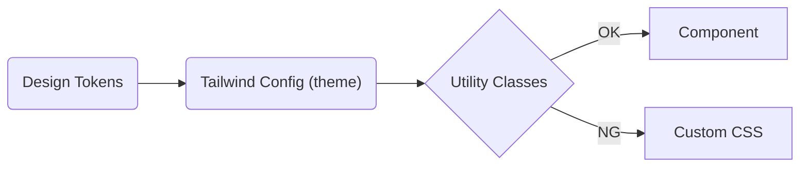

## Viteのプロジェクトの作成

Vite + Vue + TypeScriptの構成を選択します。

```zsh:zsh
  pnpm create vite@latest hands-on-app  --template vue-ts
  cd path/to/hands-on-app
  pnpm install
```

`pnpm run dev` でdev modeの動作確認まで行いましょう。

## Tailwind CSSのインストール

公式ドキュメント通りにインストールと初期設定を行います。
[Install Tailwind CSS with Vite | Installation](https://tailwindcss.com/docs/guides/vite#vue)

```zsh:zsh
  pnpm add -D tailwindcss postcss autoprefixer
  pnpm tailwindcss init -p
```

`postcss.config.js` と `tailwind.config.js` が作成されます。
`create vite` で生成されたボイラープレートで残す必要の無いものは書き換えてしまって問題ありません。
Installationに記載されている通りに `App.vue` にUtility Classesを適用し、dev modeでさっと確認しておきましょう。

```vue:src/App.vue
<template>
  <h1 class="text-3xl font-bold underline">Hello world!</h1>
</template>
```

<!-- prettier-ignore-start -->

*このようにスタイルが適用されていればOKです*
<!-- prettier-ignore-end -->

### Tailwind Configのカスタマイズ

`theme.colors` に `primary` を追加します。
[Configuration | Customization](https://tailwindcss.com/docs/configuration)

```diff javascript:tailwind.config.js
/** @type {import('tailwindcss').Config} */
export default {
  content: ["./index.html", "./src/**/*.{vue,js,ts,jsx,tsx}"],
  theme: {
+   primary: {
+     DEFAULT: "#0054e9",
+     contrast: "#ffffff",
+     shade: "#004acd",
+     tint: "#1a65eb",
+   },
+   secondary: {
+     DEFAULT: "#0163aa",
+     contrast: "#ffffff",
+     shade: "#015796",
+     tint: "#1a73b3",
+   },
    extend: {},
  },
  plugins: [],
};
```

追加したPaletteをutilityから使ってみましょう。

```diff vue:src/App.vue
 <template>
-  <h1 class="text-3xl font-bold underline">Hello world!</h1>
+  <div class="flex flex-col gap-y-2 p-4">
+    <div
+      class="flex flex-col items-center justify-center bg-primary w-80 h-8 rounded-md"
+    >
+      <span class="text-primary-contrast">Primary Box</span>
+    </div>
+
+    <p class="text-primary-shade text-sm">Primary Shade</p>
+    <p class="text-primary-tint text-lg">Primary Tint</p>
+
+    <div
+      class="flex flex-col items-center justify-center bg-secondary w-80 h-8 rounded-md"
+    >
+      <span class="text-secondary-contrast">Secondary Box </span>
+    </div>
+
+    <p class="text-secondary-shade text-sm">Secondary Shade</p>
+    <p class="text-secondary-tint text-lg">Secondary Tint</p>
+  </div>
 </template>
```

<!-- prettier-ignore-start -->

*このようになります*
<!-- prettier-ignore-end -->

## なぜTailwind CSSを選ぶのか

### Utility First

Tailwind CSSは、CSS ModulesやSCSSのようにゼロからstyleを書かず、[Utility Classesを組み合わせてスタイルを表現します](https://tailwindcss.com/docs/utility-first)。CSSセレクタの粒度と命名を開発者ではなくTailwindがハンドリングすることで実装にも制約が生まれ、カスタムCSSの乱立を防ぐことが可能です。

### コンポーネントファーストなWebフロントエンド開発との親和性

Tailwind CSSは、Vue/ReactのようなコンポーネントファーストなWebフロントエンド技術と親和性が高いのが特徴です。utilitiesの集合をコンポーネントとしてカプセル化することで、`スタイルの集合としての再利用 ≒ コンポーネント化 ≠ カスタムCSSセレクタ` のような設計指針を保つことができます。アプリケーションで一貫したStyleを保ちやすくなります。



### デザインシステムのビルドツールという位置付け

Tailwind CSSは単なるCSSライブラリではなく、デザインシステムを構築するための土台としても有効です。
`tailwind.config.js` を通じてプロジェクト固有のデザイントークン (Colors, Typography, Spacing...)を定義できます。また、デザインシステムとアプリケーション固有のデザインフィロソフィーがそれぞれ存在する場合はTailwind Configのextends/pluginsとして切り出すことでお互いを干渉させない、必要に応じてPickとOmitを行える構造にすることが容易です。
一貫性のあるデザインシステムを構築することで、Vue/Reactのような末端技術を問わず、効率的にコンポーネント開発を行うことができます。

## まとめ

Vue + ViteのアプリケーションにTailwind CSSを導入し、Utilitiesの適用・カスタマイズまでキャッチアップできました。
次は、実際に再利用可能なUI Componentを実装してみましょう。
